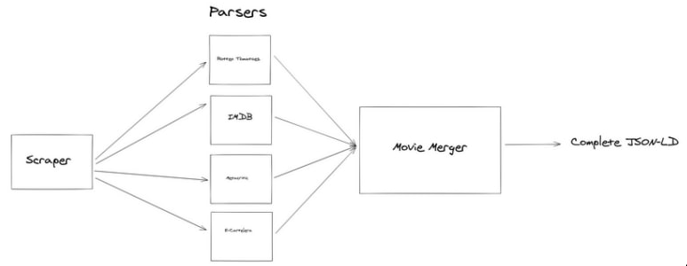

# Notas

En este informe se describen conceptos interesantes y desafios que encontramos mientras desarrollabamos el trabajo. Además de la información requerida por el enunciado. Se destaca que mucha de la implementación realizada es similar a la del TP1 para mantener consistencia.

[TOC]

## Modelo de datos
*Esta sección representa al archivo **data.txt** que especifica el enunciado.*

Al igual que en la primer entrega, primero nos enfocamos en desarrollar un modelo de pelicula que abarque la mayor parte de los campos de los JSON-LD recopilados. Para esto volvimos a usar dos librerías (_dataclasses_ y _dataclasses-json_) muy utiles para generar clases de datos simples. Esto nos permitió mantener la información consistente y tener un mayor control sobre los tipos de datos que se almacenan. Además, nos permiten exportar los datos en formato JSON. Como consecuencia, decidimos otra vez almacenar la información obtenida luego del merge en un archivo con dicho formato.

Cabe destacar que para este trabajo la estructura de la información resultó un poco más extensa que en el TP-1. A continuación se detalla el modelo principal de la película:

```python
@dataclass_json
@dataclass
class Movie(Schema):
    name: str
    description: Optional[str]
    content_rating: str
    source_urls: List[str]
    production_company: Optional[Organization]
    aggregated_ratings: List[AggregateRating]
    reviews: List[Review]
    images: List[str]
    actors: List[Person]
    characters: List[str]
    directors: List[Person]
    authors: List[Union[Person, Organization]]
    genres: List[str]
    keywords: List[str]
    duration: Optional[int]
    video: Optional[Video]
    origin: Optional[str]
    events: List[PublicationEvent]
    schema_context: str = "http://schema.org"
```

En caso de querer revisar la estructura de los datos completa, dirígase al archivo que contiene el modelo. Este se puede encontrar en `src/model/model.py`

## Respondiendo las preguntas del enunciado

*Esta sección representa al archivo **respuestas.txt** que se especifica en el enunciado.*

### ¿Cuán complejos son, en comparación con los scrappers que escribió en el TP1, los extractores que tuvo que escribir ahora?

En comparación son muchisimo más simples los extractores. Todo el problema de extraer la información de las páginas se puede resolver en unas pocas lineas de código.

```python
html = requests.get(webpage)
soup = BeautifulSoup(html, "html.parser")
json_ld = soup.select_one("script[type='application/ld+json']")
```

###  ¿Tuvo que hacer uno para cada página o pudo reutilizarlos? Si encontráramos otro sitio que hable de una pelicula utilizando Schema.org y Microdatos o JSON-LD como mecanismo de serialización, ¿podríamos utilizar estos extractores?
No hizo falta hacer más de un extractor, pudimos reutilizar el mismo para todas las páginas. Definitivamente la extración se vuelve mucho más genérica ya que los datos se **presentan** de una forma más estructurada. Aunque qusieramos destacar que la información no necesariamente tiene una estructura uniforme, es decir, no hay concenso entre las distintas páginas para respetar un formato de completitud ni de nomenclatura para el contenido de los distintos campos. Por ejemplo, los géneros en **ecartelera** están en español, mientras que en las demás páginas están en inglés.

### ¿Cuáles cree que son las ventajas y desventajas de utilizar Microdata?
En las páginas utilizadas la presencia de Microdata fue casi nula, pero entendemos que fue una primera aproximación a definir elementos con información consistente, tratando de respetar un estándar general para estructurar información como lo es *Schema.org*.
Algunas desventajas de esta implementación son:

- La complejidad a la hora de extraer los datos.
- La complejización del HTML de la página, al incluir una gran variedad de atributos extra para los tags.
- Dificulta la mantenibilidad de la información contenida en los atributos.

Una ventaja por sobre JSON-LD puede ser que para representar esquemas simples es una buena y rápida opción, ya que mientras estamos construyendo la página podemos escribir la metadata sin necesidad de armar un JSON-LD siguiendo una estructura en particular. Si bien esto trae consigo una infinidad de desventajas, está bueno para un desarrollo rápido.

### ¿Cuáles cree que son las ventajas y desventajas de utilizar JSON-LD?
Consideramos que JSON-LD posee varias ventajas en comparación a Microdata ya que la información se concentra en un único lugar y no está desparramada por todo el HTML. Su extracción es mucho más sencilla y al estar la información en formato JSON es mucho más facil de procesar o parsear.
Sin embargo existen algunas desventajas para este formato:

- La información de la página se encuentra duplicada, ya que la misma debe aparecer en el HTML y además en el archivo JSON
- Es demasiado flexible a la hora de definir los campos, por lo que puede resultar muy inconsistente al compararlo con otros JSON-LD

### ¿Cuáles cree que son las ventajas y desventajas de utilizar el vocabulario de Schema.org?
Como se dijo a lo largo del informe, la principal dificultad a la hora de obtener y comparar la información de distintas páginas es la variabilidad y la libertad con la que se definen los elementos y la estructura de los datos. Esto convierte en casi necesaria la intervención del programador para contemplar todos los casos posibles. En caso de que se produzca un cambio en la estructura de los datos la recolección de información colapsaría, por lo que es un proceso muy frágil.

La principal ventaja de Schema.org es brindar un estándar para definir los datos y los campos. Por otra parte, la principal desventaja es la falta de restricciones que posee. Por este motivo, en la mayoría de los casos los elementos descriptos por formatos como JSON-LD y Microdata difieren de la estructura que provee Schema.org.

### ¿Cuáles cree que son los desafíos que todavía quedan por resolver?
Antes de responder esta pregunta, nos gustaría explicar brevemente como está estructurado el script:



- **Scraper**: Primero el script invoca a un scraper que se encarga de extraer la información de los sitios definidos, como se mencionó anteriormente, este scraper es único para todos los sitios, dado que se utiliza JSON-LD. Mientras que en el TP anterior necesitabamos definir un scraper por cada sitio.
- **Parsers**: Luego, el script normaliza todos los campos en un formato específico (por ejemplo, las fechas en timestamp, la duración en minutos, etc.). Notemos que para esta etapa, el script necesita 1 parser para cada sitio, ya que el contenido de cada campo es diferente.
  Por ejemplo, miremos **imdb** como expresa las fechas de la Review:
  `"dateCreated": "2021-01-02"`
  Ahora miremos como la expresa **rotten tomatoes**:
  `"dateCreated": "2017-09-13T08:24:15-07:00"`
  Además, es necesario aclarar, que el formato del contenido de cada campo puede variar de película en película incluso si pertenecen al mismo sitio, ya que Schema.org no nos asegura ningún formato específico.
- **Merger**: Una vez normalizados los datos, al igual que en el TP anterior, se utiliza una estrategia de "mergeo" por cada campo. La mayoría fueron rehusadas del TP anterior, como por ejemplo, la identificación de la película, quedarse con la duración máxima, etc.
  En particular, nos gustaría destacar que el campo género está en español en **ecartelera**, mientras que en los demás sitios están en inglés. Por lo tanto, para resolverlo se tradujeron todos los géneros a inglés y se los unificó en una lista sin repetidos.

Por lo tanto, respondiendo la pregunta, entre los desafíos que todavía nos generan conflictos están:

- Las peliculas no tienen un identificador único y universal. Puede variar la forma de escribir su título en las diferentes páginas en cuanto a lenguaje e interpretación, por lo que no es un buen identificador.
- Es necesario contemplar las diferencias que puedan presentar en cuanto a nomenclatura y estructura los diferentes campos de las distintas páginas. Por lo que es requerido tener varios "reparadores" o "parsers" de JSON-LD o, minimamente tener un solo parser que contemple todos los casos con mucho código específico.
- El hecho de parsear la información recopilada genera que el proceso sea muy sensible a cambios en los datos. Puede dejar de funcionar con facilidad. Por lo que consideramos que nuestros parsers son best-effort ya que puede fallar en determinados formatos.

## Películas extras

Una vez terminada la extracción de las 4 películas que especificaba el enunciado, se decidió probar con nuevas películas, en particular Tenet y Tom & Jerry. El resultado fue éxitoso, se puede ver la unificación de las 3 películas en el archivo `data/movies.json`.

Para agregar nuevos sitios, se deben seguir los siguientes pasos:

1. En el archivo `src/main.py`: Agregar en la lista `EXTRA_SITES` los sitios que se deseen scrapear, junto con el parser a utilizar y el nombre de archivo que se desee guardar:

   ```python
   EXTRA_SITES = [
       {
           "url": "https://www.rottentomatoes.com/m/tenet",
           "parser": RottenTomatoesParser,
           "filename": "tenet-rotten-tomatoes"
       },
       {
           "url": "https://www.metacritic.com/movie/tenet",
           "parser": MetacriticParser,
           "filename": "tenet-metacritic"
       },
       {
           "url": "https://www.imdb.com/title/tt1361336/",
           "parser": ImdbParser,
           "filename": "tom-y-jerry-imdb"
       },
   ]
   ```

   Eventualmente puede ser migrado a un archivo de configuración, pero debido a que las películas son pocas, se decidió mantenerlo en el código.

2. Ejecutar el script `src/main.py` con la opción `--extra`:
   `python3 main.py --extra`

3. La unificación de las películas se guardará en el archivo `data/movies.json`.

Cabe recalcar nuevamente que nuestros parsers son best-effort, es decir, pueden fallar en algunos sitios si no se respeta el formato de *Schema.org* con el que fue analizado.

## Otros desafíos que se fueron presentando

### Cambio del User-Agent
Para la extracción del JSON-LD de algunas páginas fue necesario modificar el header *User-Agent* ya que por defecto en las peticiones del módulo *requests* de Python tienen el siguiente formato
```
python-requests/{package version} {runtime}/{runtime version} {uname}/{uname -r}
```
Este formato era reconocido y filtrado por algunas de las páginas, deducimos que lo hacen con la intención de evitar bots que generen demasiado tráfico y sobrecarguen los servidores. Para sortear este obstaculo bastó con modificar el header a un string random o dejarlo vacío. En nuestro caso:
```python
response = requests.get(url, headers={"User-Agent": ""})
```

### Profundidad de la información
Durante el análisis de los datos vimos casos, por ejemplo en el de los actores, en los que el valor de uno de sus campos resultaba en un link a otra página con otro JSON-LD detallando su información particular. Consideramos que esta información era irrelevante con respecto a la pelicula y que con conocer la información básica de los actores alcanza. En caso de querer scrapear esta información se podría acceder recursivamente a las urls utilizando el mismo scraper, aunque habria que tener en cuenta problemas de recursión ciclica, entre otras cosas.

### El campo "duración"

El campo duración de las películas, difiere en cada sitio, ya que en algunos están en minutos, mientras que en otros están en horas. Por ejemplo, en **imdb**:

`"duration": "PT2H31M"`

Mientras que en **metacritic**:

``"duration": "PT151M"``

Se decidió pasar todas las duraciones a minutos mediante el módulo [Durations](https://github.com/oleiade/durations) de Python, el cual nos permite de forma simple pasar de texto a datetime para que podamos extraer los minutos.