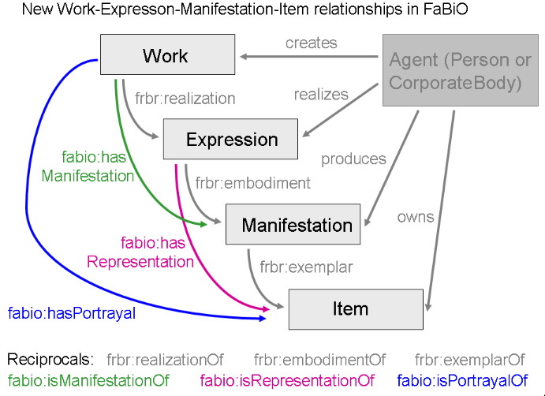

# Notas
En este informe se tratan algunos de los temas más interesantes que nos surgieron durante la producción del trabajo.

## Comentarios del Trabajo

- En el archivo **movie_individuals.ttl** se pueden algunas inconsistencias producto de la importación de los individuals generados con Protégé durante el desarrollo (presentes en el archivo **movie.ttl**). Decidimos dejar estos individuals ya que acompaña el modelo a modo de documentación adicional. Un ejemplo de estas inconsistencias es que los atributos y clases definidas en **movie.ttl** están en minuscula, mientras que las generadas por nuestro programa utiliza una nomenclatura CamelCase. Por ejemplo el individual '**t**enet' es el creado manualmente y el individual '**T**enet' es el que extrae el script.

- Debido a la imposibilidad de apertura de Cinemalaplata por la pandemia, no están cargando con peliculas la cartelera de su página, por este motivo el scrapeo falla. Igualmente pudimos trabajar con los datos de Cinepolis, Ecartelera, Metacritic, Rotten Tomatoes e IMDB correctamente.

## Respondiendo las preguntas del enunciado

*Esta sección representa al archivo **respuestas.txt** que se especifica en el enunciado.*

### ¿Qué ventajas supone que hubiese obtenido si en los trabajos anteriores contaba con la información descrita en OWL?
Creemos que hubiera sido mucho más facil de procesar ya que existen herramientas como **Protégé** que nos permiten importar los datos de una forma más sencilla y automatizada. Además, como los datos están pensados para ser consumidos publicamente no tendríamos que preocuparnos por hacer el scrapeo de las páginas (contando con que el scrapeo puede variar conforme las modificaciones que presente la página en el tiempo). También, gracias al manejo de recursos a través de URIs la posibilidad de que la obtención de los datos se modifique se minimiza en gran medida. Y en caso de que el *recurso* representado por una URI sufra cambios no genera un gran problema para la estructura de datos, ya que al ser de tipo gráfo presenta una gran flexibilidad.

Esta flexibilidad sin embargo puede traer ciertas desventajas, por ejemplo durante el desarrollo notamos que en ningún momento se hace un control de los tipos ni de la información que se introduce en el gráfo, a pesar de especificarle un rango y dominio, de ahí surgen herramientas especiales como HerMit. Aún así, consideramos que esta falta de estructura es inherente a la gran dificultad que existe para representar los datos debido a su variabilidad y múltiple interpretación. Problema para el cúal todavía no encontramos solución y venimos arrastrando desde los anteriores TPs.

 ### ¿Qué ventajas tiene utilizar vocabularios existentes en lugar de crear los propios?

Principalmente nos facilita la nomenclatura de conceptos y nos permite "estandarizar" la forma de referirnos a un determinado recurso. Por ejemplo los actores se definen como "actor" en schema.org y "starring" en dpedia.

Lo consideramos como un intento natural de solucionar el problema planteado de la gran variabilidad y múltiple interpretación de los datos, el cual busca ponerle un único nombre y en un conjunto selecto de idiomas a un determinado concepto.

Además se aprovechan las características del dominio que ya está modelado, el cuál puede ser muy complejo para modelar uno mismo, por ejemplo FaBio proporciona las siguientes propiedades para las publicaciones de artículos bibliográficos:



Además los vocabularios son muy flexibles y permiten conectarlos entre sí, en nuestro caso subclasificamos la clase Review de FaBio para darle origen a MovieReview, luego conectamos esta review con Ratings de Schema.org y Movies de dbpedia.org a través de object properties. 

### ¿Utilizó solamente clases y propiedades de un único vocabulario?

No, utilizamos varios vocabularios. Principalmente partimos de DBpedia para la mayoría de los atributos relacionados con peliculas y las relaciones con los actores, autores, directores, etc. El vocabulario FaBiO nos sirvió bastante para representar las reviews. Adicionalmente utilizamos una pequeña parte de Schema.org para representar los ratings de las peliculas.

Si bien la mayoría de los datos representados en los anteriores trabajos se basaron en la representación de Schema.org decidimos que la ontología en OWL no nos convencía por tener muchas discrepancias con la forma de representación que necesitabamos. Un poco de esto se vió reflejado en preguntas en el foro.

### ¿Que impacto hubiese tenido al momento de almacenar la información obtenida el contar con un modelo como OWL?
Siguiendo con lo mencionado en la primer respuesta, brinda mucha más flexibilidad a la hora de cargar los datos y el hecho de contar con diferentes vocabularios desarrollados por otras personas, nos permiten describir los conceptos desde un punto de vista más genérico y estandarizado. Sobre todo el tema de las cardinalidades y atributos opcionales que se menciona en la siguiente respuesta.

### ¿Qué diferencia hay entre utilizar un modelo de objetos para integrar la información que obtuvo (como hizo anteriormente) con utilizar tripletas?

Principalmente se encuentra la diferencia en situaciones en las que se ignora la cardinalidad de los elementos. También se resuelve de forma más directa la posibilidad de tener campos opcionales. Como se comentó, la flexibilidad de los gráfos también permite realizar merges entre los diferentes atributos creando relaciones que en objetos, podrían llegar a ser mucho más complejas. Por otra parte esto involucra un menor grado de control sobre los datos y sus tipos.

### ¿Cuán dificil es generar archivos OWL en otros formatos (por ejemplo N3, RDF/XML) a partir de la información que tiene? Y con su scrapper.

Para realizar la deserialización y serialización de los datos utilizamos la librería recomendada por la cátedra RDFlib, esta librería acepta una cantidad considerable de formatos en los que se puede expresar un archivo OWL. Nos sorprendió la sencillez con la que se puede modificar el formato con el cual se importa y exportan los datos. Solo con el pasaje de un parámetro este asunto queda resuelto.

```python
serialized_graph = graph.serialize(format="turtle").decode("utf-8")
```
