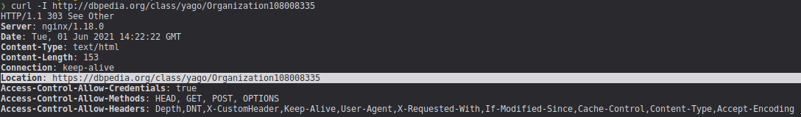
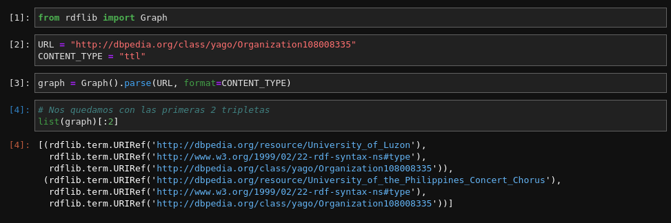
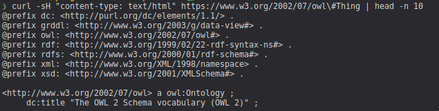

# Ejercicio 2

Se ejecutó la siguiente consulta en el [motor de sparql de dbpedia](http://dbpedia.org/sparql):

```SPARQL
select ?property ?object where {
 dbr:National_University_of_La_Plata ?property ?object.
}
```

## Exploración

- El motor de sparql ofrece muchos formatos para mostrar los resultados de la consulta, algunos de los más importantes son los siguientes:
  - HTML: Se convierte la salida en tablas HTML, cuyo encabezado está compuesto por los campos elegidos en el select de la consulta. Es buena opción para humanos.
  - Turtle: Se convierte la salida en formato turtle con un formato específico, resulta de utilidad para los parsers de las librerías y computadoras.
  - Javascript: Se obtiene la tabla de HTML pero escrita en consola.
  - Entre otros como XML, spreadsheet, etc.

- Los prefijos se pueden ver en el siguiente [link](https://dbpedia.org/sparql/?help=nsdecl). Se puede observar que están los más utilizados en los TPs anteriores y muchos más.
- iSPARQL se puede ver en el siguiente [link](https://dbpedia.org/isparql). Es un editor interactivo que permite hacer las consultas de manera más simple y amigable para el usuario.

## Respuestas

1 . En la pantalla que muestra resultados de queries en HTML: 

**¿Qué pasa cuando hace click en una URI que pertenece al dominio dbpedia.org?**

Cuando se hace click en cualquier URI que pertenece a dbpedia, se muestra una descripción del recurso para humanos. Por ejemplo: https://dbpedia.org/class/yago/Organization108008335

**¿Qué pasa si la URI está afuera?**

Cuando se hace click en alguna URI fuera del dominio de dbpedia.org, se muestra un archivo turtle. Por ejemplo: https://www.w3.org/2002/07/owl#Thing

**¿A que cree que se debe la diferencia en comportamiento?** (recuerde que al clickear la URI estamos dereferenciando el recurso, como discutimos en la clase respecto a Linked Data).

En el caso de dbpedia, se hace un content negotation, tal como vimos en la clase de LInked Data. Si lo vemos con un curl paso a paso lo podemos ver mejor:

A continuación se hace una request **HEAD** a la siguiente URI http://dbpedia.org/class/yago/Organization108008335:



Nos devolvió un código **303**, lo cual significa que tenemos que redirigirnos a la URI que contiene el atributo **Location**. Por lo tanto, se realiza otra petición **HEAD** a la URI https://dbpedia.org/class/yago/Organization108008335:


Como podemos ver, en el campo **link** se tienen diferentes URLs para ir a buscar un recurso mediante un content-type (html, turtle, rdf, etc.). En el caso del browser, va a negociar un content-type de tipo HTML y es por eso que nos devuelve la descripción para humanos. 


Pero en el caso de una librería como **rdflib** va a ir a buscar el tipo de recurso que le indiquemos, por ejemplo un ttl:



En caso de otras URIs, como por ejemplo https://www.w3.org/2002/07/owl#Thing no se puede hacer content-negotiation ya que devuelve como respuesta un **ttl** independientemente si pedimos un HTML como content-type:



Incluso si pedimos las cabeceras, nos indica que la extensión alternativa del recurso es **ttl**, por lo que podemos inferir que solo devuelve archivos turtle:


Ya vimos que dbpedia puede devolver un archivo turtle o un archivo HTML haciendo content-negotation en una misma URI. En cambio w3 necesita una URI en particular para cada recurso, y en particular, en los resultados sparql aparece solo la URI que lleva al archivo turtle. Por lo tanto, ahora la pregunta es ¿Por qué se necesita que se devuelvan archivos turtle en los resultados de SPARQL? Esto basicamente es para implementar el mecanismo "Follow your nose", el cuál consiste en acceder a cada URI y extraer información hasta cierta profundidad para responder querys que la requieran, de igual forma que hicimos para extraer las fechas de nacimiento y ocupaciones de los actores en el anterior TP.

