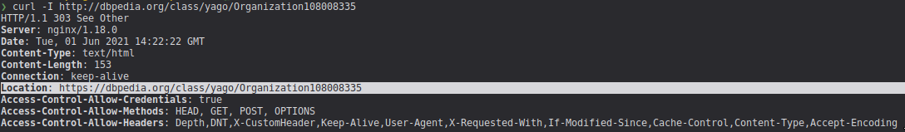
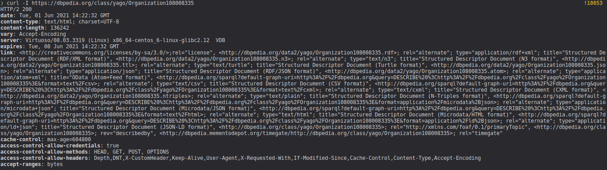
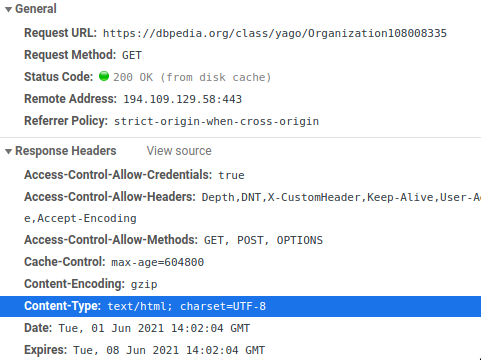
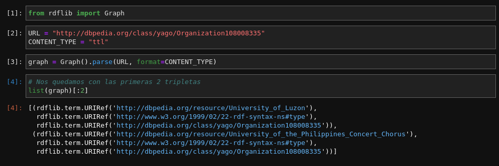
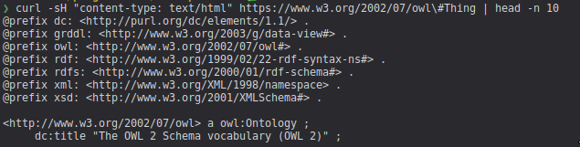
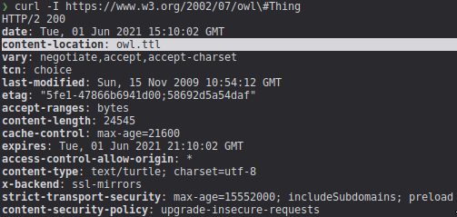
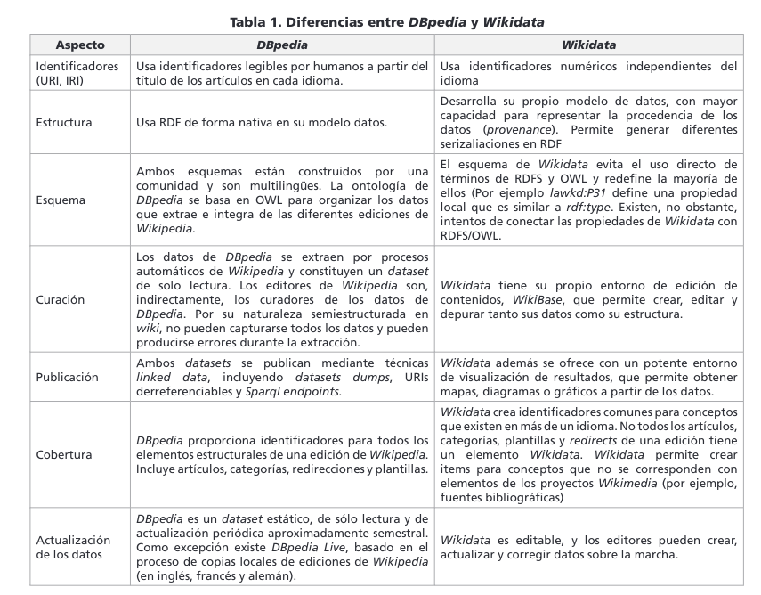

# Trabajo Práctico Nº5 - Respuestas

[TOC]

## Ejercicio 1

Lectura recomendada:
http://svn.aksw.org/papers/2013/SWJ_DBpedia/public.pdf

1. **¿Qué es dbpedia?**

Dbpedia es un proyecto que se encarga de extraer la información disponible en Wikipedia para luego hacerla pública utilizando tecnologías de Web Semántica y Linked Data. Así, de esta forma se puede llegar a formar bases de conocimientos que permitan responder consultas expresivas e interesantes sobre los datos.

2. **¿De donde sale la información disponible en dbpedia?**

La información es extraída de Wikipedia. El proyecto DBpedia se enfoca en construir una base de conocimiento de gran escala, orientada a múltiples lenguajes. Esto lo logra obteniendo la información de artículos los cuales llegan a tener ediciones en hasta 111 lenguajes.

3. **¿Que partes de los artículos de Wikipedia se transforman en tripletas?**

La mayor parte de los artículos de Wikipedia es compuesta por texto simple, sin embargo existe información que está representada con otros mecanismos. Algunos de estos son fichas de información, categorías, imágenes, coordenadas geográficas, links a páginas externas, links de desambiguación, redirecciones y links a ediciones de Wikipedia en diferentes lenguajes.
Para realizar la extracción de toda esta información DBpedia posee un framework con varias etapas de extracción. Primero se obtienen las páginas de Wikipedia, luego se realiza un parseo de la información generando un Abstract Syntax Tree (AST) con los diferentes componentes de la página, a continuación se pasa el AST por varios mecanismos de extracción específicos para los diferentes componentes de los artículos. Por último la información extraída se almacena en forma de tripletas en diferentes formatos para su posterior explotación semántica.

4. **¿Cual es el esquema de URIs que utiliza Dbpedia?**

Por cada artículo en Wikipedia se introducen varias URIs para representar los conceptos que aparecen en la página. Hasta 2011, DBpedia publicó las URIs bajo el dominio http://dbpedia.org. Los principales subdominios eran:

- http://dbpedia.org/resource/ : Con el prefijo **dbr** para representar los datos de los artículos.
- http://dbpedia.org/property/ : Con el prefijo **dbp** para representar las propiedades extraídas sin modificaciones de la *infobox* o ficha de información principal de la página.
- http://dbpedia.org/ontology/ : Con el prefijo **dbo** para representar la ontología de DBpedia

De esta forma, en caso de haber información adicional de un recurso en ediciones cuyo idioma fuera diferente al Inglés, solo se agregaría al recurso en cuestión en caso de existir una versión en Inglés linkeada a la correspondiente información adicional.

A partir de la versión 3.7 de DBpedia, se decidió que esta forma de procesar los datos omitía mucha información importante y se optó por generar dos tipos de datasets diferentes.

- *Localized data sets*: Contienen todas las cosas que están descritas en un lenguaje determinado. Estos recursos pasarían en alojarse en URIs del tipo http://\<lang\>.dbpedia.org/resource/ y sus propiedades en http://\<lang\>.dbpedia.org/property/
- *Canonicalized data sets*: Contienen toda la información representada por las versiones en inglés de los artículos de Wikipedia. Estos recursos se identifican de la misma manera que en las versiones previas (http://dbpedia.org/resource/)


5. **¿Dado el articulo en Wikipedia de "National University of La Plata", como infiero la URL del recurso correspondiente en dbpedia? ¿Cuál sería para Argentina? ¿Y para Uruguay? (exprese su respuesta aprovechando el prefijo dbr:  para referirse a http://dbpedia.org/resource/)**

Es posible inferir su correspondiente recurso en DBpedia dado el título del artículo. Esto es así dado que existe un mapeo uno a uno entre las páginas de Wikipedia y los recursos de DBpedia basados en el título.
De esta forma, si el artículo correspondiente con la Universidad Nacional de La Plata en Wikipedia está representado por https://en.wikipedia.org/wiki/National_University_of_La_Plata en DBpedia estará representado por dbr:National_University_of_La_Plata.

Para https://es.wikipedia.org/wiki/Argentina sería dbr:Argentina.

Para https://es.wikipedia.org/wiki/Uruguay sería dbr:Uruguay.

6. **¿Cuál es la diferencia entre las propiedades definidas en dbo: y las propiedades definidas en dbp:?**

Una de las partes fundamentales de los artículos en Wikipedia son las fichas informativas que aparecen al principio del artículo en la esquina superior derecha (para los idiomas que se leen de izquierda a derecha). En estas fichas se resumen los datos más importantes del artículo o del concepto en cuestión.

Como esta tabla informativa no está normalizada y no respeta tipos de datos en sus atributos puede resultar complejo de parsear (ej: un atributo número puede estar representado como numero: mil o numero: 1000). Debido a esta problemática se decidió realizar dos parseos diferentes de los datos. 
Uno que recolecta la información de forma literal tolerando todas las inconsistencias que esta información pueda tener. Y otro que realiza una interpretación más profunda de los datos encontrados,  este parseo mantiene diferentes versiones de las tablas y trata de mergear la información de la manera más coherente posible, incluso llegando a crear recursos adicionales con los datos que se encuentran.

En el primer caso se habla de atributos que poseen el prefijo dbp: y en el segundo caso de los atributos prefijados con dbo:

7.  **¿Cuantas clases y cuantas propiedades tiene la ontología de dbpedia de acuerdo a lo reportado en el artículo?**

La ontología de DBpedia consiste de 320 clases las cuales incorporan una jerarquía descrita por 1.650 propiedades diferentes.

8. **¿En que URL puedo ver el listado completo de Clases en la ontología de dbpedia?**

Se pueden ver y navegar todas las clases definidas en la ontología de DBpedia en la siguiente URL: http://mappings.dbpedia.org/server/ontology/classes/

## Ejercicio 2

Se ejecutó la siguiente consulta en el [motor de sparql de dbpedia](http://dbpedia.org/sparql):

```SPARQL
select ?property ?object where {
 dbr:National_University_of_La_Plata ?property ?object.
}
```

### Exploración

- El motor de sparql ofrece muchos formatos para mostrar los resultados de la consulta, algunos de los más importantes son los siguientes:
  - HTML: Se convierte la salida en tablas HTML, cuyo encabezado está compuesto por los campos elegidos en el select de la consulta. Es buena opción para humanos.
  - Turtle: Se convierte la salida en formato turtle con un formato específico, resulta de utilidad para los parsers de las librerías y computadoras.
  - Javascript: Se obtiene la tabla de HTML pero escrita en consola.
  - Entre otros como XML, spreadsheet, etc.

- Los prefijos se pueden ver en el siguiente [link](https://dbpedia.org/sparql/?help=nsdecl). Se puede observar que están los más utilizados en los TPs anteriores y muchos más.
- iSPARQL se puede ver en el siguiente [link](https://dbpedia.org/isparql). Es un editor interactivo que permite hacer las consultas de manera más simple y amigable para el usuario.

### Respuestas

**1 . En la pantalla que muestra resultados de queries en HTML:** 

**¿Qué pasa cuando hace click en una URI que pertenece al dominio dbpedia.org?**

Cuando se hace click en cualquier URI que pertenece a dbpedia, se muestra una descripción del recurso para humanos. Por ejemplo: https://dbpedia.org/class/yago/Organization108008335

**¿Qué pasa si la URI está afuera?**

Cuando se hace click en alguna URI fuera del dominio de dbpedia.org, se muestra un archivo turtle. Por ejemplo: https://www.w3.org/2002/07/owl#Thing

**¿A que cree que se debe la diferencia en comportamiento?** (recuerde que al clickear la URI estamos dereferenciando el recurso, como discutimos en la clase respecto a Linked Data).

En el caso de dbpedia, se hace un content negotation, tal como vimos en la clase de LInked Data. Si lo vemos con un curl paso a paso lo podemos ver mejor:

A continuación se hace una request **HEAD** a la siguiente URI http://dbpedia.org/class/yago/Organization108008335:



Nos devolvió un código **303**, lo cual significa que tenemos que redirigirnos a la URI que contiene el atributo **Location**. Por lo tanto, se realiza otra petición **HEAD** a la URI https://dbpedia.org/class/yago/Organization108008335:



Como podemos ver, en el campo **link** se tienen diferentes URLs para ir a buscar un recurso mediante un content-type (html, turtle, rdf, etc.). En el caso del browser, va a negociar un content-type de tipo HTML y es por eso que nos devuelve la descripción para humanos. 



Pero en el caso de una librería como **rdflib** va a ir a buscar el tipo de recurso que le indiquemos, por ejemplo un ttl:



En caso de otras URIs, como por ejemplo https://www.w3.org/2002/07/owl#Thing no se puede hacer content-negotiation ya que devuelve como respuesta un **ttl** independientemente si pedimos un HTML como content-type:



Incluso si pedimos las cabeceras, nos indica que la extensión alternativa del recurso es **ttl**, por lo que podemos inferir que solo devuelve archivos turtle:



Ya vimos que dbpedia puede devolver un archivo turtle o un archivo HTML haciendo content-negotation en una misma URI. En cambio w3 necesita una URI en particular para cada recurso, y en particular, en los resultados sparql aparece solo la URI que lleva al archivo turtle. Por lo tanto, ahora la pregunta es ¿Por qué se necesita que se devuelvan archivos turtle en los resultados de SPARQL? Esto básicamente es para implementar el mecanismo "Follow your nose", el cuál consiste en acceder a cada URI y extraer información hasta cierta profundidad para responder querys que la requieran, de igual forma que hicimos para extraer las fechas de nacimiento y ocupaciones de los actores en el anterior TP.

## Ejercicio 3

A continuación se describen las siguientes consultas mediante SPARQL:

**a)** **Obtener a los escritores que hayan nacido en una ciudad de Argentina.** 

```SPARQL
SELECT DISTINCT ?writer WHERE {
    ?writer rdf:type dbo:Writer. 
    ?writer dbo:birthPlace / dbo:country dbr:Argentina.
}
```

El resultado se puede ver haciendo click en este [link](https://dbpedia.org/isparql/execute.html?query=SELECT%20DISTINCT%20%3Fwriter%20WHERE%20%7B%0A%20%20%20%20%3Fwriter%20rdf%3Atype%20dbo%3AWriter.%20%0A%20%20%20%20%3Fwriter%20dbo%3AbirthPlace%20%2F%20dbo%3Acountry%20dbr%3AArgentina.%0A%7D&endpoint=%2Fsparql&maxrows=50&timeout=&default-graph-uri=http%3A%2F%2Fdbpedia.org&view=1&amode=0&raw_iris=true).

**b)** **Obtener a los escritores que hayan nacido en una ciudad de Uruguay.**

```SPARQL
SELECT DISTINCT ?writer WHERE {
    ?writer rdf:type dbo:Writer. 
    ?writer dbo:birthPlace / dbo:country dbr:Uruguay.
}
```

El resultado se puede ver haciendo click en este [link](https://dbpedia.org/isparql/execute.html?query=SELECT%20DISTINCT%20%3Fwriter%20WHERE%20%7B%0A%20%20%20%20%3Fwriter%20rdf%3Atype%20dbo%3AWriter.%20%0A%20%20%20%20%3Fwriter%20dbo%3AbirthPlace%20%2F%20dbo%3Acountry%20dbr%3AUruguay.%0A%7D&endpoint=%2Fsparql&maxrows=50&timeout=&default-graph-uri=http%3A%2F%2Fdbpedia.org&view=1&amode=0&raw_iris=true). 

**c)** **Utilizando el keyword filter (vea sección 6.3.2.6 del libro), obtener a los escritores que hayan nacido en una ciudad de Argentina o de Uruguay.**

```SPARQL
SELECT DISTINCT ?writer WHERE {
    ?writer rdf:type dbo:Writer. 
    ?writer dbo:birthPlace / dbo:country ?country
    FILTER(?country = dbr:Argentina || ?country = dbr:Uruguay).
}
```

El resultado se puede ver haciendo click en este [link](https://dbpedia.org/isparql/execute.html?query=SELECT%20DISTINCT%20%3Fwriter%20%3Fcountry%20WHERE%20%7B%0A%20%20%20%20%3Fwriter%20rdf%3Atype%20dbo%3AWriter.%20%0A%20%20%20%20%3Fwriter%20dbo%3AbirthPlace%20%2F%20dbo%3Acountry%20%3Fcountry%0A%20%20%20%20FILTER(%3Fcountry%20%3D%20dbr%3AArgentina%20%7C%7C%20%3Fcountry%20%3D%20dbr%3AUruguay).%0A%7D&endpoint=%2Fsparql&maxrows=50&timeout=&default-graph-uri=http%3A%2F%2Fdbpedia.org&view=1&amode=0&raw_iris=true).

* Nota: Se proyectan los países para que sea más fácil la verificación de la unión.

**d)** **Utilizando el keyword union (vea sección 6.3.2.6 del libro), obtener a los escritores que hayan nacido en una ciudad de Argentina o de Uruguay**

```SPARQL
SELECT DISTINCT ?writer WHERE {
    { ?writer rdf:type dbo:Writer. 
      ?writer dbo:birthPlace / dbo:country dbr:Argentina. }
    UNION
    { ?writer rdf:type dbo:Writer. 
      ?writer dbo:birthPlace / dbo:country dbr:Uruguay.}
}
```

El resultado se puede ver haciendo click en este [link](https://dbpedia.org/isparql/execute.html?query=SELECT%20DISTINCT%20%3Fwriter%20WHERE%20%7B%0A%20%20%20%20%7B%20%3Fwriter%20rdf%3Atype%20dbo%3AWriter.%20%0A%20%20%20%20%20%20%3Fwriter%20dbo%3AbirthPlace%20%2F%20dbo%3Acountry%20dbr%3AArgentina.%20%7D%0A%20%20%20%20UNION%0A%20%20%20%20%7B%20%3Fwriter%20rdf%3Atype%20dbo%3AWriter.%20%0A%20%20%20%20%20%20%3Fwriter%20dbo%3AbirthPlace%20%2F%20dbo%3Acountry%20dbr%3AUruguay.%7D%0A%7D&endpoint=%2Fsparql&maxrows=50&timeout=&default-graph-uri=http%3A%2F%2Fdbpedia.org&view=1&amode=0&raw_iris=true).

**e)** **¿Qué diferencia hay entre c y d? ¿En cual se deben recuperar/analizar menor número de tripletas?**

La diferencia es que en la **unión** se deben evaluar 2 conjuntos de tripletas y luego unirlas. Por lo tanto, haríamos 3 operaciones sobre el conjunto de tripletas. En cambio en el **filter** solo se aplica la condición del filtro una vez, por lo que a priori parece más eficiente, luego habrá que ver, porque quizás el motor de SPARQL aplica técnicas de optimización en la unión para equiparar los tiempos.

También la diferencia está en la sintaxis, quizás en este caso resulte redundante utilizar la unión, pero podemos tener querys más complicadas y simplemente con el operador UNION podemos unirlas, sin necesidad de "tocar" las querys que lo componen.

Por lo tanto, utilizar UNION o FILTER dependerá del caso y habrá que hacer un balance entre esfuerzo de programación y eficiencia para decidir cual es el más adecuado.

**f)** **¿Cuantos empleados tiene la compañía mas grande en dbpedia, y en que país está ubicada? (obtenga la lista de todas las compañías y los países donde están ubicadas ordenada de forma descendiente por numero de empleados)**

```SPARQL
SELECT DISTINCT ?company ?country ?employees WHERE {
    ?company rdf:type dbo:Company ; dbo:numberOfEmployees ?employees.

    OPTIONAL { # DBO location -> Most priority
        ?company dbo:location / dbo:country ?country.
    }
    OPTIONAL { # DBP Location with Country as RDF type
        ?company dbp:locationCity / dbo:country ?country.
    }
    OPTIONAL { # DBP Location with Country as string
        VALUES (?dbpProperty) { (dbp:locationCountry) (dbp:hqLocationCountry) }
        ?company ?dbpProperty ?country.
    }
}
ORDER BY DESC(?employees)
```

La compañía más grande registrada en dbpedia es Ritek con 59003000 empleados y es de Taiwán.  El país no está registrado oficialmente en **dbo**. Sin embargo, si está registrado en **dbp**.

El resultado se puede ver haciendo click en este [link](https://dbpedia.org/isparql/execute.html?query=SELECT%20DISTINCT%20%3Fcompany%20%3Fcountry%20%3Femployees%20WHERE%20%7B%0A%20%20%20%20%3Fcompany%20rdf%3Atype%20dbo%3ACompany%20%3B%20dbo%3AnumberOfEmployees%20%3Femployees.%0A%0A%20%20%20%20OPTIONAL%20%7B%20%23%20DBO%20location%20-%3E%20Most%20priority%0A%20%20%20%20%20%20%20%20%3Fcompany%20dbo%3Alocation%20%2F%20dbo%3Acountry%20%3Fcountry.%0A%20%20%20%20%7D%0A%20%20%20%20OPTIONAL%20%7B%20%23%20DBP%20Location%20with%20Country%20as%20RDF%20type%0A%20%20%20%20%20%20%20%20%3Fcompany%20dbp%3AlocationCity%20%2F%20dbo%3Acountry%20%3Fcountry.%0A%20%20%20%20%7D%0A%20%20%20%20OPTIONAL%20%7B%20%23%20DBP%20Location%20with%20Country%20as%20string%0A%20%20%20%20%20%20%20%20VALUES%20(%3FdbpProperty)%20%7B%20(dbp%3AlocationCountry)%20(dbp%3AhqLocationCountry)%20%7D%0A%20%20%20%20%20%20%20%20%3Fcompany%20%3FdbpProperty%20%3Fcountry.%0A%20%20%20%20%7D%0A%7D%0AORDER%20BY%20DESC(%3Femployees)&endpoint=%2Fsparql&maxrows=50&timeout=&default-graph-uri=http%3A%2F%2Fdbpedia.org&view=1&amode=0&raw_iris=true).

## Ejercicio 4

1. **¿Qué es wikidata?**

Wikidata es un proyecto similar al de DBpedia, los creadores la definen como una base de datos libre, colaborativa, multilingüe, que sirve como una base de datos secundaria y que recopila datos estructurados (semánticos) para dar soporte a Wikipedia, Wikimedia Commons, así como a otras wikis del movimiento Wikimedia y a cualquier persona del mundo.

2. **¿De donde sale la información disponible en Wikidata?**

La información de Wikidata es creada automáticamente cuando se publica un artículo en Wikipedia, como mínimo de cada artículo se obtiene al menos una etiqueta en un idioma, una mínima descripción para desambiguar y un sitelink al correspondiente artículo o artículos en cada edición de Wikipedia. Los datos de Wikidata también son producto de la carga, modificación y borrado manual de información de editores de todo el mundo.

La información recopilada en Wikidata es utilizada como una base de conocimiento estructurado cuyo objetivo es mantener una fuente común de datos para su reutilización en otros proyectos Wikimedia. De esta forma si varios artículos de Wikipedia dependen del mismo dato, bastaría solo con modificar la información de Wikidata para que se reflejen los cambios en todos los artículos. Y no por otra parte, modificar todos los artículos individualmente.

3. **¿Que partes de los artículos de Wikipedia se transforman en tripletas?**

La información en Wikidata esta compuesta por items (conformados por una etiqueta, una descripción y varios alias). Estos items pueden tener propiedades cuyo valor permiten describir con mayor granularidad al item en cuestión.
Con este esquema es habitual encontrar la información presente en las fichas técnicas de los articulos ya que se aproximan a un modelo `propiedad=valor`. Sin embargo, esto no limita a que un editor pueda agregar otras propiedades.

4. **¿Cual es el esquema de URIs que utiliza Wikidata?**

Wikidata posee un esquema de asignación de identificadores IRI únicos, de forma que tanto la definición de los datos en sí, como de las propiedades que los describen se encuentran autocontenidos en Wikidata. Estos identificadores son númericos, factor que permite a Wikidata independizar al identificador del idioma de los elementos.

5. **¿Dado el articulo en Wikipedia de "National University of La Plata", como infiero la URL del recurso correspondiente en Wikidata?**

A simple vista no se podría inferir el identificador de Wikidata por lo expresado en el anterior punto. Se deberá proceder a la página de Wikidata y buscar el elemento por su título.

6. **¿Que diferencias y similitudes encuentra con DBpedia?**



El cuadro anterior fue extraido del siguiente [paper](https://recyt.fecyt.es/index.php/ThinkEPI/article/download/thinkepi.2018.31/39185).

7. **Adapte las queries que construyo en los puntos c y d del ejercicio anterior en el endpoint de Wikidata. (https://query.wikidata.org). ¿Obtuvo resultados diferentes? Si la respuesta es si, ¿a que se deben?**

Si, los resultados fueron distintos. Esto se debe a que Wikidata posee una mayor cantidad de clases y clasificaciones. Además la cantidad de información almacenada en Wikidata es distinta a la cantidad en DBpedia.

## Ejercicio 5

### Consultas sobre los directores ganadores del Oscar

Para implementar esta parte, se realizaron 2 consultas `CONSTRUCT`, la cual arma un grafo temporal tanto para DBpedia, como para Wikidata:

```SPARQL
PREFIX tmp: <http://tmp.org#>
CONSTRUCT {
    ?actor tmp:wasDirectedByOscarWinner ?director.
    ?actor tmp:name ?actorName.
}
WHERE {
    SELECT DISTINCT ?actor ?director ?actorName
    WHERE {
        # Match movies
        ?movie rdf:type dbo:Film.
        # Match the actors of the movies
        ?movie dbo:starring ?actor.
        # Extract the labels of the actors
        ?actor rdfs:label ?actorName.
        # Match the directors of the movies
        ?movie dbo:director ?director.
        # Match the directors who won an Oscar
        ?oscarAward dbp:wikiPageUsesTemplate dbt:Academy_Awards.
        ?director dbo:award ?oscarAward.
        # Filter the actors by label (spanish and english)
        FILTER regex(?actorName, {actors_regex}, "i").
        FILTER (LANGMATCHES(LANG(?actorName), "en")) || (LANGMATCHES(LANG(?actorName), "es"))
    }
}
```

```SPARQL
PREFIX tmp: <http://tmp.org#>
CONSTRUCT {
    ?actor tmp:wasDirectedByOscarWinner ?director.
    ?actor tmp:name ?actorName.
}
WHERE {
    SELECT DISTINCT ?actor ?director ?actorName
    WHERE {
        # Match the directors of the movies
        ?movie wdt:P31 wd:Q11424 ; wdt:P57 ?director.
        # Match the directors who won an Oscar
        ?director wdt:P166 wd:Q19020.
        # Match the actors of the movies
        ?movie wdt:P161 ?actor.
        # Extract the labels of the actors
        ?actor rdfs:label ?actorName.
        # Filter the actors by label (spanish and english)
        FILTER regex(?actorName, {actors_regex}, "i").
        FILTER((LANGMATCHES(LANG(?actorName), "en")) || (LANGMATCHES(LANG(?actorName), "es")))
  }
}
```

- Se utiliza `DISTINCT` porque puede haber resultados repetidos en el caso de que un actor haya sido dirigido por un director que ganó un Oscar en más de una película.
- La variable {actors_regex} representa la siguiente regex: `(actor_name_1|actor_name_2|..)`, esta misma es seteada por Python en ejecución a medida que se leen los actores de nuestra base de conocimiento. La razón de utilizar un grupo de regex es para generar la menor cantidad de consultas posibles, ya que los motores de SPARQL ponen restricciones en su uso. La discusión más detallada se puede ver en el siguiente hilo del foro: https://asignaturas.info.unlp.edu.ar/mod/forum/discuss.php?d=204#p533 .

Al armar un subgrafo, esto nos permite manejar un cierto "polimorfismo" entre dbpedia y wikidata. Lo único que falta es relacionar cada actor de nuestra base de conocimiento con los resultados que obtuvimos anteriormente ¿Por qué? Porque recordamos que utilizamos regex para traer toda la información en la menor cantidad de consultas posibles, en cambio, si traíamos la información recorriendo cada actor en específico, podíamos relacionarlos de una forma más fácil, pero el costo era muy grande en términos de rendimiento. Por lo tanto, se combinaron ambos grafos obtenidos previamente y se realizó la siguiente consulta local mediante `rdflib`:

```SPARQL
PREFIX tmp: <http://tmp.org#>
CONSTRUCT {
    ?twss_actor :wasDirectedByOscarWinner ?remote_director
}
WHERE {
    # Extract remote info.
    ?remote_actor tmp:wasDirectedByOscarWinner ?remote_director.
    ?remote_actor tmp:name ?remote_actor_name.
    # Extract local info.
    ?twss_actor a ns1:Actor ; ns1:Name ?twss_actor_name.
    # Match local and remote actors by name.
    FILTER regex(?remote_actor_name, ?twss_actor_name, "i")
}
```

Como podemos notar, la consulta genera el grafo que queremos como resultado. Para ello, se matchea el nombre de wikidata/dbpedia con el nombre del actor de nuestra base de conocimiento.

- Nota: En esta consulta queda claro el uso de "polimorfismo" entre dbpedia y wikidata a través del prefijo **tmp**.

### Respuestas

**¿Qué diferencias, ventajas y desventajas le encuentra al uso de SPARQL?**

Como diferencia al TP anterior, podemos notar que no tuvimos que usar dereferenciamiento en ningún caso, por lo tanto, esto es una ventaja de utilizar SPARQL, ya que al trabajar con pattern matching no se necesita ingresar uno por uno a cada archivo ttl y extraer la información.

Otra ventaja es que los motores de SPARQL generalmente están sobre base de datos (como en dbpedia/wikidata) y no sobre archivos de texto, esto permite que las consultas se ejecuten mucho más rápido. También SPARQL se asemeja mucho a SQL, por lo que el salto de aprendizaje de uno a otro es muy leve en términos de esfuerzo. 

También, a diferencia del TP anterior, SPARQL utiliza un paradigma declarativo, lo que refleja mucho mejor la información que queremos obtener frente a un paradigma imperativo que llevaría muchas más líneas de código.

Como desventaja notamos que los motores piden muchas restricciones sobre su uso, y se necesitan hacer algunas "estrategias" para ejecutar la información en el menor tiempo posible.

Otra desventaja que observamos fue la complejidad que se torna al usar la sentencia `OPTIONAL`, al ser una cláusula común en la Web Semántica (ya que es un mundo libre) consideramos que se podría implementar de otra forma, ya que hay consultas que están anidadas con optionals y se vuelven muy complicadas de entender. Si bien esto corre por el lado del programador, nos pareció un punto para destacar

**Si utilizó alguna librería específica comente brevemente las ventajas que encontró, y cómo le ayudo en su solución.**

Utilizamos rdflib como en las anteriores entregas para guardar y actualizar nuestra base de conocimiento. Nos permitió abrir y manipular nuestros grafos de una forma más programática.

Para las consultas SPARQL utilizamos la librería **sparqlwrapper**, la cual permitió hacer las consultas a los motores SPARQL desde Python con mayor abstracción. Particularmente se encapsuló esta lógica en la siguiente función:

```python
def get_sparql_query(source, query):
    sparql = SPARQLWrapper(source)

    sparql.setQuery(query)
    results = sparql.query().convert()

    return results
```


