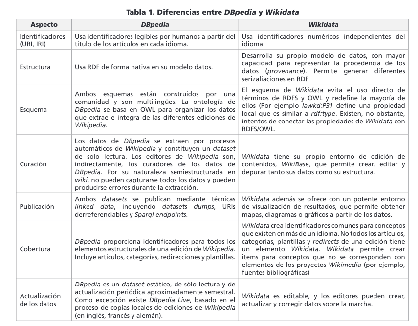

1. ¿Qué es wikidata?

Wikidata es un proyecto similar al de DBpedia, los creadores la definen como una base de datos libre, colaborativa, multilingüe, que sirve como una base de datos secundaria y que recopila datos estructurados (semánticos) para dar soporte a Wikipedia, Wikimedia Commons, así como a otras wikis del movimiento Wikimedia y a cualquier persona del mundo.

2. ¿De donde sale la información disponible en Wikidata?

La información de Wikidata es creada automáticamente cuando se publica un artículo en Wikipedia, como mínimo de cada artículo se obtiene al menos una etiqueta en un idioma, una mínima descripción para desambiguar y un sitelink al correspondiente artículo o artículos en cada edición de Wikipedia. Los datos de Wikidata también son producto de la carga, modificación y borrado manual de información de editores de todo el mundo.

La información recopilada en Wikidata es utilizada como una base de conocimiento estructurado cuyo objetivo es mantener una fuente común de datos para su reutilización en otros proyectos Wikimedia. De esta forma si varios artículos de Wikipedia dependen del mismo dato, vastaría solo con modificar la información de Wikidata para que se reflejen los cambios en todos los artículos. Y no por otra parte, modificar todos los artículos individualmente.

3. ¿Que partes de los artículos de Wikipedia se transforman en tripletas?

La información en Wikidata esta compuesta por items (conformados por una etiqueta, una descripción y varios alias). Estos items pueden tener propiedades cuyo valor permiten describir con mayor granularidad al item en cuestión.
Con este esquema es habitual encontrar la información presente en las fichas técnicas de los articulos ya que se aproximan a un modelo `propiedad=valor`. Sin embargo, esto no limita a que un editor pueda agregar otras propiedades.

4. ¿Cual es el esquema de URIs que utiliza Wikidata?

Wikidata posee un esquema de asignación de identificadores IRI únicos, de forma que tanto la definición de los datos en sí, como de las propiedades que los describen se encuentran autocontenidos en Wikidata. Estos identificadores son númericos, factor que permite a Wikidata independizar al identificador del idioma de los elementos.

5. ¿Dado el articulo en Wikipedia de "National University of La Plata", como infiero la URL del recurso correspondiente en Wikidata?

A simple vista no se podría inferir el identificador de Wikidata por lo expresado en el anterior punto. Se deberá proceder a la página de Wikidata y buscar el elemento por su título.

6. ¿Que diferencias y similitudes encuentra con DBpedia?

El cuadro anterior fue extraido del siguiente [paper](https://recyt.fecyt.es/index.php/ThinkEPI/article/download/thinkepi.2018.31/39185).

7. Adapte las queries que construyo en los puntos c y d del ejercicio anterior en el endpoint de Wikidata. (https://query.wikidata.org). ¿Obtuvo resultados diferentes? Si la respuesta es si, ¿a que se deben?

